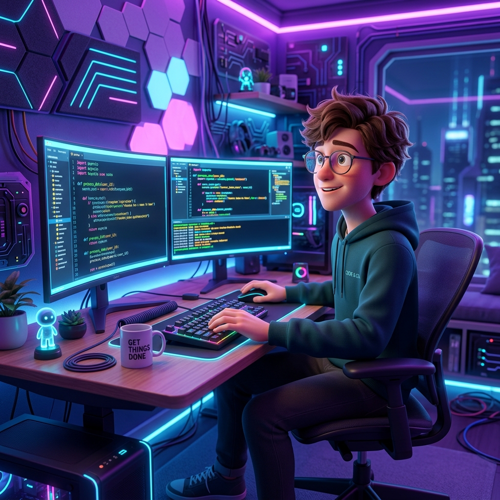

# 01 | Personal Portfolio Hub

A premium, high-fidelity single-page portfolio hub linking all 9 other frontend projects and UI clones built for Girish.

## 🔗 Live Demo & Repository
* **Live Demo:** [https://girish.github.io/portfolio-hub/](https://girish.github.io/portfolio-hub/)
* **Code Repository:** [https://github.com/girish/portfolio-hub](https://github.com/girish/portfolio-hub)

---

## 📸 Screenshots

### Desktop View

### Mobile View

---

## ✨ Features List

* **Responsive Hero Section**: Displays a modern 3D animated character avatar surrounded by orbital dashed rotating rings and interactive tech badges (JS, React, Node.js, CSS3) bobbing with custom floats.
* **Integrated About Me & Skills Section**: 
  * Features a circular AI-generated coding avatar (`about_avatar.jpg`) with a glowing pink border.
  * Embeds the 6-skill listing directly inside the About Me description column for a compact, unified layout.
  * Each skill is rendered as a **custom-designed pill button that glows with its specific brand color** (e.g. orange for HTML5, yellow for JS, cyan for React, green for Node, etc.) on hover.
* **Clean Project Cards**: Displays your 9 builds in two separate grid modules:
  * **Core Builds (02-06)**: Dynamic e-commerce, Swiggy-style food ordering, watch landing pages, and educational institute clones.
  * **The Clone Wall (07-10)**: High-fidelity CSS UI mockups representing Instagram, LinkedIn, Spotify, and Netflix.
  * *All cards are styled in a sleek, minimalist fashion, showing only the project image, tech tags, title, description, and footer buttons.*
* **Responsive Mobile Navbar**: Transitions to a sliding panel drawer on small screens with clean, smooth scrolling anchor anchors.
* **Ambient Neon Glows**: Moving radial gradients and custom coordinate lines overlaying the dark violet background.

---

## 🛠️ Tech Stack

* **Structure**: HTML5 (Semantic elements)
* **Styling**: Vanilla CSS3 (Custom properties, grid layouts, keyframes, transitions, gradients, glassmorphism, brand-specific glow badges)
* **Logic**: Vanilla ES6+ JavaScript (DOM selection, scroll listeners)
* **Icons**: FontAwesome Icons CDN
* **Aesthetics**: Paired typography using Google Fonts (`Outfit` and `Plus Jakarta Sans` only)

---

## 🎨 Design References

* **Primary layout reference**: [Dribbble UI Design 45076141](https://cdn.dribbble.com/userupload/45076141/file/b82799b0d06ef82bf4286bd75e5f5043.png?resize=1024x3285&vertical=center)
* **Micro-interactions inspiration**: Refero & Aceternity UI effects

---

## 🤖 AI Tools Used

* **Gemini 3.5 Flash**: Assisting in structuring clean semantic code blocks, CSS custom properties setup, and layout balancing.
* **Gemini Image Generator**: Creating tailored high-fidelity visuals, avatars, and project mockups inside the `assets/` directory.

---

## 🧠 What I Learned

* **Inline Badge Layouts**: Implementing flex wrap structures for brand badges that respond seamlessly to mobile layouts.
* **Neon Glow Branding**: Implementing custom shadow glows in CSS using specific HSL/RGB colors mapped to individual brand names.
* **Adaptive Breakpoint Testing**: Tweaking layouts to ensure flawless display from 360px wide viewports to ultra-wide desktop monitors.

---

## 🎓 About TAP Academy

TAP Academy is a premium software training institute specializing in positioning students for success in the tech industry. With a focus on hands-on coding, placement in 60 days, AR (Augmented Reality) classrooms, and mock interviews, TAP Academy empowers aspiring developers with industry-relevant skills.

---

## ⚠️ Clones Disclaimer

This repository serves as a centralized hub hosting multiple projects. Projects **05 (Tap Academy Clone)**, **07 (Instagram Clone)**, **08 (LinkedIn Clone)**, **09 (Spotify Clone)**, and **10 (Netflix Clone)** are educational replicas created solely for learning user interface design and layout structures. They are **educational clones and are not affiliated with, sponsored by, or endorsed by** Tap Academy, Instagram, LinkedIn, Spotify, Netflix, or their respective parent companies. All brand assets, logos, and mock-layouts remain copyright of their original owners.
